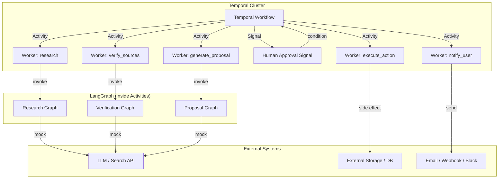

# LangGraph + Temporal Durable Agent

A production-oriented long-running AI agent demonstrating **Temporal** for durable workflow orchestration combined with **LangGraph** for bounded agent reasoning.

## Architecture



## Why This Architecture?

### Temporal is the Outer Workflow Engine

Temporal owns the **durable state machine** that orchestrates the entire research-and-approval lifecycle. Key benefits:

- **Crash resilience**: If the Python worker process crashes, Temporal retains the workflow state. When a worker restarts, Temporal replays the workflow history and resumes from the last completed Activity.
- **Durable waits**: The human approval step can wait indefinitely without keeping a Python process busy. Temporal stores the "waiting" state in its persistence layer.
- **Automatic retries**: Temporal retries failed Activities with configurable backoff policies — no manual retry loops needed.
- **Horizontal scaling**: Multiple workers can share the same task queue. Temporal distributes tasks across them.

### LangGraph is Used Inside Activities

LangGraph owns the **bounded agent reasoning** inside specific phases:

| Activity          | LangGraph Purpose                    |
| ----------------- | ------------------------------------ |
| `research`        | Search → Summarise pipeline          |
| `verify_sources`  | Source credibility verification      |
| `generate_proposal` | Proposal generation with LLM       |

LangGraph is **not** a durable workflow engine. It manages graph state during a single execution. By placing LangGraph inside Activities, we get:

- **Bounded scope**: Each graph has a clear input/output contract.
- **No persistence conflicts**: Temporal owns the long-lived state; LangGraph owns the short-lived graph state.
- **Testability**: LangGraph graphs can be tested independently of Temporal.

### Why External I/O Belongs in Activities

**Never** perform external I/O (LLM calls, HTTP requests, database writes, file reads) directly inside Workflow code. Workflow code is **deterministic** — it is replayed every time a worker loads the workflow state. If Workflow code made an HTTP request on every replay, you'd get:

- Duplicate API calls
- Non-deterministic results (different LLM responses on each replay)
- Corrupted state

Activities are **not** replayed — they execute once, and Temporal records their result. All external I/O belongs in Activities.

## Workflow Execution Flow

```
Temporal Workflow
│
├── 1. research Activity
│       └── Research LangGraph (search → summarize)
│
├── 2. verify_sources Activity
│       └── Verification LangGraph (verify_sources)
│
├── 3. generate_proposal Activity
│       └── Proposal LangGraph (generate_proposal)
│
├── 4. WAIT FOR HUMAN APPROVAL
│       └── Temporal Signal (durable — no Python process needed)
│
├── 5. execute_action Activity
│       └── Idempotent side effect
│
└── 6. notify_user Activity
        └── External notification
```

## Retry Policies

Temporal retries failed Activities automatically. Different Activities have different retry characteristics based on their nature:

| Activity             | Max Attempts | Initial Backoff | Max Backoff | Rationale                         |
| -------------------- | ------------ | --------------- | ----------- | --------------------------------- |
| `research`           | 5            | 2 s             | 2 min       | Transient network/LLM failures    |
| `verify_sources`     | 5            | 2 s             | 2 min       | Same as research                  |
| `generate_proposal`  | 3            | 2 s             | 2 min       | Fewer retries to limit cost       |
| `execute_action`     | Default      | 1 s             | ∞           | Conservative — side effect        |
| `notify_user`        | Default      | 1 s             | ∞           | Notification should eventually deliver |

**Do not** implement manual retry loops inside Workflow code. Use Temporal's `RetryPolicy`.

## Human Approval

Human approval uses a **Temporal Signal**:

1. The workflow reaches `wait_condition` and pauses durably.
2. A client sends a signal (`approve` or `reject`) to the workflow handle.
3. Temporal delivers the signal to the workflow when a worker replays it.
4. The workflow resumes execution based on the signal value.

```python
@workflow.signal
async def approve(self, approved: bool):
    self.approval_received = True
    self.approved = approved

# In the workflow:
await workflow.wait_condition(
    lambda: self.approval_received is not None,
)
```

**Key point**: The workflow can wait for days, months, or years. No Python process is kept alive. Temporal stores the waiting state in its database.

## Worker Failure

When the Python worker process crashes:

1. Temporal detects that the Activity heartbeat has stopped.
2. If the Activity had a `start_to_close_timeout`, Temporal marks it as failed after the timeout expires.
3. Temporal retries the Activity (up to the configured `maximum_attempts`).
4. When a new worker starts (or the crashed one recovers), Temporal assigns the retried Activity to an available worker.
5. The workflow replays its history to the point of failure, then executes the retried Activity.

**Important**: Workflow code is deterministic and replayed. Activity code executes once (unless retried by Temporal).

## Multiple Workers

Multiple instances of `python -m app.worker` can run simultaneously:

```bash
# Terminal 1
python -m app.worker

# Terminal 2
python -m app.worker

# Terminal 3
python -m app.worker
```

All connect to the same Temporal Server and listen on the same task queue (`research-agent`). Temporal distributes tasks across workers automatically.

## Prerequisites

- **Python 3.12+**
- **Existing Temporal Server** (not managed by this project)

No Docker, Docker Compose, or Kubernetes setup required.

## Installation

```bash
cd langgraph-temporal-agent
pip install -e .
```

## Configuration

Copy `.env.example` to `.env` and configure:

```bash
cp .env.example .env
```

Edit `.env`:

```env
TEMPORAL_ADDRESS=temporal.example.internal:7233
TEMPORAL_NAMESPACE=default
TEMPORAL_TASK_QUEUE=research-agent

# Optional future LLM integration
OPENAI_API_KEY=
```

### Environment Variables

| Variable             | Description                          | Default               |
| -------------------- | ------------------------------------ | --------------------- |
| `TEMPORAL_ADDRESS`   | Temporal Server host:port            | `localhost:7233`      |
| `TEMPORAL_NAMESPACE` | Temporal namespace                   | `default`             |
| `TEMPORAL_TASK_QUEUE`| Task queue name                      | `research-agent`      |
| `OPENAI_API_KEY`     | OpenAI API key (optional)            | _(empty)_             |

## Usage

### Start the Worker

```bash
export TEMPORAL_ADDRESS=172.17.0.1:7233
export TEMPORAL_NAMESPACE=default
export TEMPORAL_TASK_QUEUE=research-agent

python -m app.worker
```

### Start a Workflow

```bash
python -m app.client start \
    "Should our company migrate from PostgreSQL to CockroachDB?"
```

Output:

```
Workflow started:
  workflow_id: research-abc12345
  run_id:      def67890
```

### Approve a Workflow

```bash
python -m app.client approve research-abc12345
```

### Reject a Workflow

```bash
python -m app.client reject research-abc12345
```

### Check Workflow Status

```bash
python -m app.client status research-abc12345
```

## Running Tests

### LangGraph Tests

Tests the three LangGraph graphs in isolation:

```bash
pytest tests/test_graphs.py -v
```

### Temporal Workflow Tests

Uses Temporal's `TestingEnvironment` (no real Temporal Server required):

```bash
pytest tests/test_workflow.py -v
```

### All Tests

```bash
pytest -v
```

## Large Data Handling

**Do not pass large documents through Temporal.** Temporal history has size limits, and storing large artifacts in workflow state is inefficient.

Instead, use external object storage:

```
Temporal Workflow
        │
        └── document_id (e.g., "s3://bucket/research/abc123")
                │
                ▼
        Object Storage (S3 / GCS / Azure Blob)
```

The models in [`app/models.py`](app/models.py) include an `external_doc_ids` field for this purpose.

## LangGraph Persistence

**Do not add LangGraph checkpointing for the entire long-running workflow.** Temporal is the source of truth for the workflow lifecycle between Activities. Use:

| System            | Purpose                      |
| ----------------- | ---------------------------- |
| Temporal          | Durable workflow state       |
| LangGraph         | Bounded agent execution      |
| External DB/Storage | Large application artifacts |

Redundant persistence systems that all attempt to own the same state create confusion and inconsistency.

## Idempotency

External side-effecting Activities can be retried by Temporal. The `execute_action` Activity demonstrates correct idempotency handling:

```
Activity executes external action
        ↓
external action succeeds
        ↓
worker crashes before Temporal receives completion
        ↓
Temporal retries Activity
        ↓
same idempotency key
        ↓
external system returns existing result
```

The idempotency key is derived from the Workflow ID:

```python
idempotency_key = f"{workflow_id}:execute-action"
```

**Temporal does NOT make arbitrary external APIs exactly-once.** Idempotency keys are the developer's responsibility.

## Project Structure

```
langgraph-temporal-agent/
│
├── app/
│   ├── __init__.py       # Package marker
│   ├── models.py         # Pydantic data models
│   ├── graphs.py         # LangGraph graphs
│   ├── activities.py     # Temporal Activities
│   ├── workflow.py       # Temporal Workflow
│   ├── worker.py         # Worker entry point
│   └── client.py         # CLI client
│
├── tests/
│   ├── test_graphs.py    # LangGraph unit tests
│   └── test_workflow.py  # Temporal workflow tests
│
├── pyproject.toml        # Project dependencies
├── .env.example          # Environment template
└── README.md             # This file
```

## Future: Kubernetes Deployment

This project can be deployed on Kubernetes by:

1. Building a container image from a simple `Dockerfile`:
   ```dockerfile
   FROM python:3.12-slim
   WORKDIR /app
   COPY pyproject.toml .
   RUN pip install --no-cache-dir -e .
   CMD ["python", "-m", "app.worker"]
   ```

2. Creating a Kubernetes Deployment with the appropriate replicas:
   ```yaml
   apiVersion: apps/v1
   kind: Deployment
   metadata:
     name: research-agent
   spec:
     replicas: 3
     selector:
       matchLabels:
         app: research-agent
     template:
       metadata:
         labels:
           app: research-agent
       spec:
         containers:
         - name: worker
           image: research-agent:latest
           envFrom:
           - secretRef:
               name: temporal-credentials
   ```

3. Storing Temporal credentials in a Kubernetes Secret.

No infrastructure code is included in this project — it assumes an existing Temporal Server.

## Future: Langfuse Integration

Langfuse can be added for observability:

1. Install Langfuse SDK:
   ```bash
   pip install langfuse
   ```

2. Configure tracing in Activities:
   ```python
   from langfuse import Langfuse

   lf = Langfuse()

   @activity.defn
   async def research(request: ResearchRequest) -> ResearchResult:
       trace = lf.trace(name="research-activity")
       trace.update_input(request.model_dump())

       graph = build_research_graph()
       result = await graph.ainvoke(...)

       trace.update_output(result.model_dump())
       trace.flush()

       return result
   ```

3. Set environment variables:
   ```env
   LANGFUSE_PUBLIC_KEY=your-key
   LANGFUSE_SECRET_KEY=your-secret
   LANGFUSE_HOST=https://cloud.langfuse.com
   ```

Langfuse traces would show:
- Each Activity invocation
- LangGraph graph execution within Activities
- Input/output of each phase
- Timing and error information

## Temporal Determinism — Critical Rules

**Workflow code MUST NOT:**
- Call an LLM
- Make HTTP requests
- Access a database
- Read arbitrary files
- Use random numbers directly
- Depend on current wall-clock time (use Temporal's `workflow.now()`)
- Access environment-dependent state
- Perform external I/O
- Call arbitrary nondeterministic Python code

**Workflow code SHOULD:**
- Call Activities (by name)
- Use Temporal signals, conditions, and timers
- Perform deterministic data transformations
- Log (using `workflow.logger`)

All external operations belong in **Activities**.
